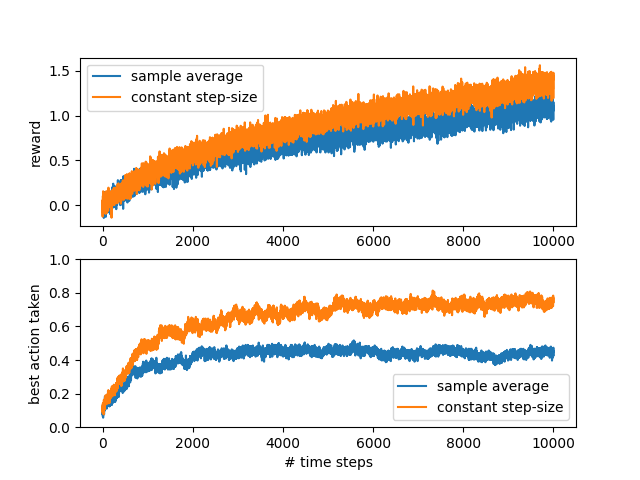

# CS 374R - Reinforcement Learning

## Introduction
Welcome to CS374R Reinforcement Learning. This repository will serve as your home base for all programming assignments for the course.

You are free to work ahead on the programming assignments, note however that they won't be supported by the TA's until they are officially released on Canvas.

### [**It is very important your local setup matches the autograder! Instructions are here!**](./docs/setup.md)

## Using this Repo
There are 2 main commands available within the repo:

* `python run.py {assignment}` - runs a visualization script for an assignment.
  * This usually has several command-line options for changing the environment, various hyperparameters, etc.
  * You'll want to use this for early debugging as well as visualizing your code in complex environments once you pass the tests. 

* `python test.py {assignment}` - runs the unit tests for the assignment.
  * Note: these tests are not necessarily the same ones that run on the autograder. There's actually more tests here than in the autograder, which typically just checks for overall correctness.
  * You likely will not succeed in the autograder if you have failing tests locally. On the other hand, passing all local tests does not guarantee that you will pass the autograder.

## Repo Structure
`assignments/` - contains the starter code for each of the assignments for the course.

`interfaces/` - contains shared code that will be usable on the grader. You can import

`lib/` - contains helper functionality for visualizing and testing your code. **You should NOT import from here in your code, as it's not guaranteed to exist on the autograder!**

`logs/` - this folde is ignored by git, but  

`run.py` - The main script for running various visualizations and debugging scripts.

`test.py` - The main script for testing your code. If you pass here, you are likely, but not guaranteed to pass the autograder.

## [PA #1 (Chapter 2) - Nonstationary Bandit Problem](./docs/PA1.md)
In this assignment you will be simulating a non-stationary bandit problem using the 10-armed testbed with both sample average and constant step size Q-estimates. At the end of the assignment, you'll be able to visualize how your agent performs and learns:

## [PA #2 (Chapter 4) - Value Iteration and Value Prediction](./docs/PA2.md)
In this assignment you'll be learning how to solve for the ideal V, Q, and policy for an environment, given a full model of the environment. You'll also learn how to evaluate the V and Q functions for a given policy running in an environment.

At the end of the assignment, you'll be able to inspect these values and see your policy running in a few Gym environments:
| FrozenLake | Taxi |
| ---------- | ---- |
|  |  |
> Note: these images are not ideal policies, you will see something much better!

## Academic Integrity
### Class rules
* **Sharing your solution is expressly prohibited.**
  * To facilitate learning, however, you can share small snippets that illustrate how to do something with numpy or torch.
* If you upload this repository to GitHub, it *must* be in a private policy.
* Using an LLM like ChatGPT, GitHub Copilot is **not** allowed. (You'll also spend more time debugging that code than if you just wrote and understoof it yourself.)

### [UT Honor Code](https://provost.utexas.edu/initiatives/new-honor-code-updated-2023/)
> **Affirmation**
> * I pledge, as a member of the University of Texas community, to do my work honestly, respectfully, and through the intentional pursuit of learning and scholarship.
>
> **Elaboration**
> * I pledge to be honest about what I create and to acknowledge what I use that belongs to others.
> * I pledge to value the process of learning in addition to the outcome, while celebrating and learning from mistakes.
> * This code encompasses all of the academic and scholarly endeavors of the university community.
