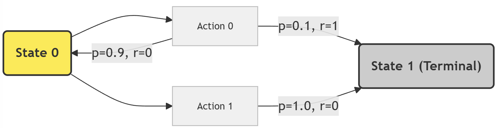
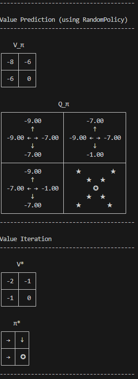
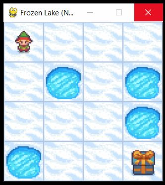
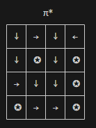

# PA #2 (Chapter 4) - Value Prediction & Value Iteration

## Algorithm Details
| Value prediction |              |
|------------------|--------------|
| **On/off policy:** | Off-policy   |
| **Target policy:** | N/A          |
| **Policy update:** | N/A          |
| **Control or Prediction:** | Prediction |
| **Observation space:** | Discrete |
| **Action space:**      | Discrete |
| **Objective:**         | Estimate $V_{\pi}$ |

| Value iteration |               |
|-----------------|---------------|
| **On/off policy:** | On-policy    |
| **Target policy:** | Deterministic, greedy |
| **Policy update:** | Constant step-size    |
| **Control or Prediction:** | Control |
| **Observation space:** | Discrete |
| **Action space:**      | Discrete |
| **Objective:**         | Estimate $V^*$ |

## Learning Objectives
In this assignment you will learn how to solve a model of the environment to determine:
* The ideal value function $V^*$ and ideal policy $\pi^*$
* The value function $V_{\pi}$, given an arbitrary policy

## Introduction
In this programming assignment, you will implement 2 algorithms introduced in Chapter 4. General instructions and requirements can be found in `dp.py`. Luckily, both these algorithms are described using psuedocode in the textbook.

You need to implement two dynamic programming algorithms:
* Value Prediction *(Iterative Policy Evaluation on **Page 75** of the textbook)*
* Value Iteration *(**Page 83**)*

The algorithms are similar, but have some subtle differences.

In value prediction, we are attempting to use a policy to learn the value function under that policy. This
won't be the ideal policy, it's just calculating essentially what the policy views the values of different
states as, based on the actions and action probabilities of the policy.

In value iteration, we are attempting to use the transition dynamics alone to solve for the ideal policy.
Note that this isn't exactly learning, per se, since we have a full and exact model of how the environment works. However, using this method you'll be able to create an ideal policy that you can see running in the `Taxi` and `FrozenLake` gym environments!

## Coding Details
### `policy_deterministic_greedy.py`
The easiest place to start is with `policy_deterministic_greedy.py`. First try running `python test.py dp`.
All the tests will be failing. We are going to try to get the `Policy_DeterministicGreedy` tests working.

In the file, implement the `action` and `action_prob` functions.
These should be pretty straightforward, as this is a deterministic, greedy policy. It always chooses the
highest valued action, given a state. This also means `action_prob` will always return a 0 or a 1.
Get these tests working.

### `dp.py`
#### `value_prediction()`
There are two algorithms to implement. Start with `value_prediction()`. You'll want to stick closely to
the algorithm in the book, although there is one important thing to note.

The transition dynamics are stored in the `P` variable. You can index into this using a `state`, and an `action`. The result is a list of potential transitions. Each transition is a tuple (`probability`, `reward`, `next_state`, `is_terminal`). You only need the first 3.

Once you write the code, you can run the tests. Hopefully you pass OneStateMDP and SmallGridWorld. If not,
you may want to try running one of these individually using `python run.py --environment {ENV}`. You can
read more details about the environments below.

#### `value_iteration()`
In `value_prediction()` you will solve for the ideal policy. Here, you only need the transition dynamics,
and instead of weighting each V using the action probabilities, you'll simply want to use the Q-value
of the best action as the V for the state.

Similarly to above, the unit tests run on OneStateMDP and SmallGridWorld, however you can run this
on more environments with the `run.py` command. If using one of the gym environments, you'll also
get to see the policy running! Try out Taxi and FrozenLake.

### Environments
There are 6 different environments we have wrapped for you to use in this assignment:

#### OneStateMDP-v0
This is a simple MDP that looks like:

This should be easy enough to solve by hand, so it's a good one for debugging with.

#### GridWorld2x2-v0
This is a small GridWorld environment. It has 2 rows and 2 columns. The bottom right is a terminal state.
You get $-1$ rewards on every transition (there's no positive reward for getting to terminal state, the 
episode just ends).

Here's the expected values from this environment:

#### WrappedFrozenLake-v0

This it the gym [FrozenLake](https://gymnasium.farama.org/environments/toy_text/frozen_lake/) environment, wrapped so you can visualize the V and Q functions similarly to
the small test environments. This version has the slippery mode turned off, so it's deterministic. A
working ideal policy will move straight to the goal.

An ideal policy looks like:

#### WrappedFrozenLakeSlippery-v0

This is the [FrozenLake](https://gymnasium.farama.org/environments/toy_text/frozen_lake/) environment again, but with slippery mode turned on. This means it has non-deterministic transitions (i.e. you may not move the way you hope). An ideal policy doesn't
always succeed in the time limit, but it usually does.

### WrappedTaxi-v0

Taxi is yet another [gym environment](https://gymnasium.farama.org/environments/toy_text/taxi/). The goal is to pickup passengers and then drop them off at their destinations.
In this environment there are actually 6 actions, including drop-off customer & pick-up customer.
This environment is rather large and can take a moment to solve, however, it's
pretty interesting. 

#### WrappedCliffWalking-v0

This is another [gym environment](https://gymnasium.farama.org/environments/toy_text/cliff_walking/) from Sutton & Barto. However, you'll notice that we don't succeed here at all,
we simply get stuck in the bottom left. This is expected. You can think about why this might be the case
(hint: the cliff has a big negative reward, there's no positive reward for getting to the terminal state, and we use a deterministic greedy policy).

### Visualizing your results
Try running `python run.py --environment {ENV}` where `{ENV}` is one of the environments listed above.

You'll see results from vaue prediction first (using a equiprobable policy). Then you'll see the V, Q, and policy from the policy iteration. Last, if it's a gym environment, you'll see a single run.

## Deliverables
Submit the following files to the autograder. Do not zip them up.

* `dp.py`
* `policy_deterministic_greedy.py`

