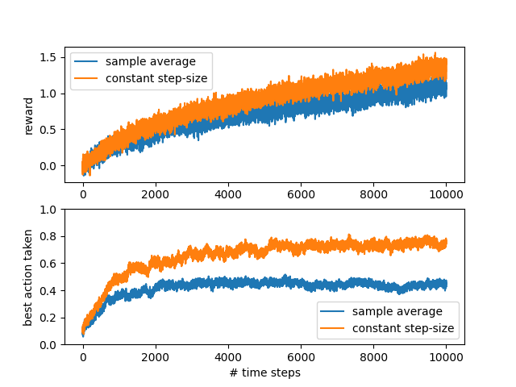

# PA #1 (Chapter 2) - Nonstationary Bandit Problem 

## Algorithm Details
| Non-stationary k-Armed Bandits |  |
|-------------|-------------|
| **On/off policy:** | On-policy |
| **Target policy:** | $\epsilon$-greedy |
| **Policy update:** | Sample-average & constant step-size Q-learning |
| **Control or Prediction:** | Control |
| **Observation space:** | Discrete (1 state) |
| **Action space:** | Discrete (10 actions) |
| **Objective:** | Learn $Q*$ |

## Learning objectives
In this assignment, the goal is to:
* Familiarize you with `gymasium` environments and `numpy` by modeling a simple 1-state MDP.
* Familiarize you with the `Policy` and `Solver` interfacse we will use in later assignments.
* Learn how random walks & non-stationary environments work.
* Learn how to estimate a $Q$ function using constant step-size and sample-average methods.
* Visualize how constant step size methods perform better than sample-average methods in non-stationary environments.
* Get you comfortable with this repository, the tools, and the autograder.

## Introduction
In this programming assignment, we will conduct an experiment to demonstrate the difficulties that sample-average methods have for non-stationary problems.

Use a modified version of the 10-armed testbed in which all the $Q^*(a)$ start out equally at zero and then take independent random walks: at time $t$, $\forall a, Q_t^*(a)=a_{t-1}^*(a)+\eta$, where $\eta$ is a noise sampled from a normal distribution with zero mean and $0.01^2$ variance ($0.01$ standard deviation), i.e. $n\sim\mathcal{N}(0, 0.01^2)$.
   
When the arm is selected and pulled, the $r\sim\mathcal{N}(Q^*(a), 1)$ will be provided as the reward to an agent.

With the modified non-stationary 10-armed tested, test:
1. an action-value method using sample averages
1. an action-value method using a constant step-size parameter, i.e. $\alpha=0.1$.

Use $\epsilon=0.1$ (in $\epsilon$-greedy), and iterate 10,000 steps for
each bandit with _incrementally computed_ $Q$ estimates that all start
from 0 in both cases. As was done in Figure 2.2, repeat both methods for **300** independent runs, and report (1) average rewards and (2) the ratio
of optimal actions averaged over those $300$ runs.

At a particular step, the ratio of optimal actions is calculated as the number of times the bandit took an action that was actually optimal at that timestep divided by the total number of runs, which is 300. Therefore, if at timestep 7913, the agent selected the optimal action in 210 out of the 300 runs (70%), the value for timestep 7913 should be 0.7.

Note that each averaged value should represent the number for *each timestep* rather than cumulative statistics, such as the moving average. If you are unsure about what it means, please see Section 2.3 of the textbook.

## Coding Details
First, run `python test.py bandit`. Note the tests that are already passing. Don't break those.

### [`bandit_env.py`](../assignments/bandit_env.py)
The best place to start is [`bandit_env.py`](../assignments/bandit_env.py). This file defines a custom [`gymnasium` environment](https://gymnasium.farama.org/api/env/) for the Bandit problem. Here you are going to implement 3 functions:
* `_sample_reward()` - which samples a reward from a given arm.
* `_is_ideal_action()` - which checks to see if a given action was indeed an ideal action.
* `_walk_all_arms()` - which applies noise to all the Q* values.

Implement these functions, noting the comments in the code. After you implement them, run:
`python test.py bandit`. If you successfully implemented these, you will see their respective tests passing. If you've failed, try reading the error messages for tests. If you are confused, read the [Q&A below](#qa).

### [`bandit_policy.py`](../assignments/bandit_policy.py)
Here we will implement a $\epsilon$-greedy policy. Implement the `action()` function. Take note of the comments and hints
in the code. Take a look at the interface for `Policy`, it's very simple. We will use it again in the next PA.

When you are done, run the tests again. Make sure the `action()` function tests succeed.

### [`bandit.py`](../assignments/bandit.py)
Here, you are going to implement the utilities that actually learn the Q function. Look at `SampleAverage.update()` and `SampleAverageMethod.update()` and `ConstantStepSizeMethod.update()`. Implement these functions, and re-run the tests. Note that we point you to locations in the book where these equations can be found. Again, remember that the Q function is 2-dimensional.

Once you have those tests working, you are ready to put everything together!

Last, look at the `BanditSolver` class. This class implements the `Solver` interface, which you are free to take a look at. You'll notice the `__init__()` function sets up your policy and Q-learning method.

Look in `train_episode()`. Here we have given you starter code that iterates through a single episode of a gym environment, stopping when the episode is done (we've reached a terminal state), or when the episode is truncated (we took too many steps). Since our MDP has no terminal states, it will get truncated.

Inside the loop, you will see a `TODO` block. Implement this as well. If all goes well, the last test should start passsing. You only need 3 lines of code here, don't overthink it.

### Visualizing your results
Once you've finished, try running `python run.py bandit --help`. You'll see a list of options you can configure. First, just try running with the defaults, `python run.py bandit`. You need to see a graph like this before submitting to the grader:

Lastly, try playing around with different `--k`, `--epsilon`, `--num_iteration`, and `--num_simulations` and see what happens. Which perform better or worse?

Once you are satisfied that your bandit solution is working, try uploading it to the autograder (details below).

## Autograder
Submit the following files to the autograder. Do not zip them up.

* [`bandit.py`](../assignments/bandit.py)
* [`bandit_env.py`](../assignments/bandit_env.py)
* [`bandit_policy.py`](../assignments/bandit_policy.py)

The autograder will accept a submission with fewer files, but it won't get full marks.

The autograder will ignore any other files you upload.

Make sure you select your best submission in GradeScope before the deadline. The last submission is selected by default.

## Q&A
### How does the gym environment work?
The `reset()` function resets the environment and returns a tuple with the initial state & some info. For this assignment, we will ignore the state.
The `step()` function takes an action (in this case, the selected arm).
